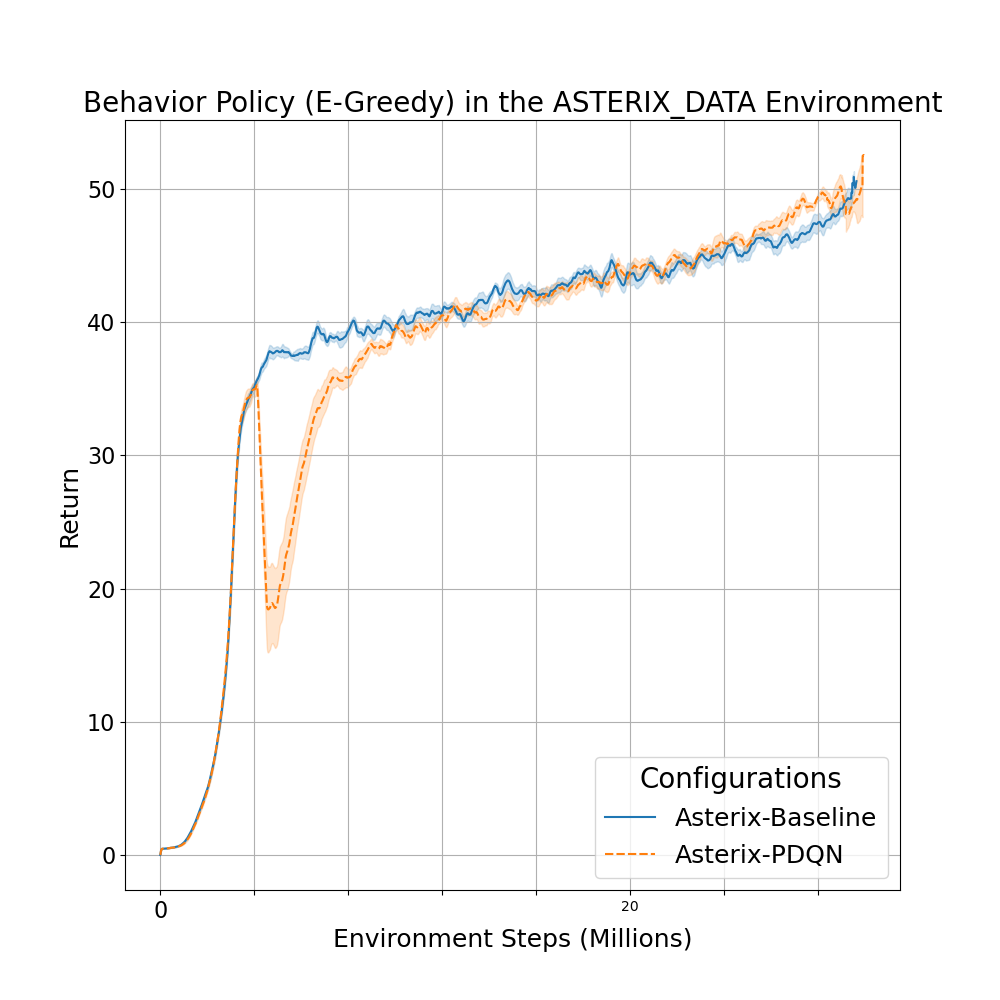
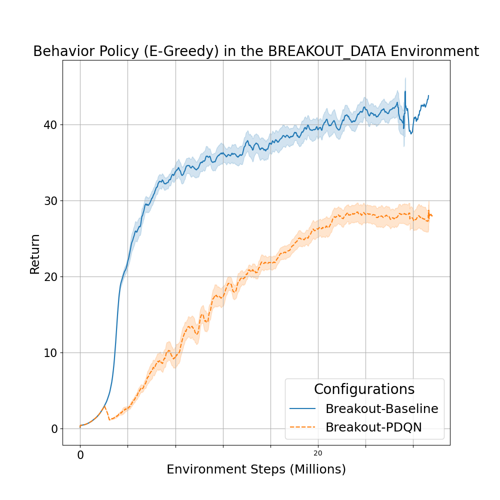
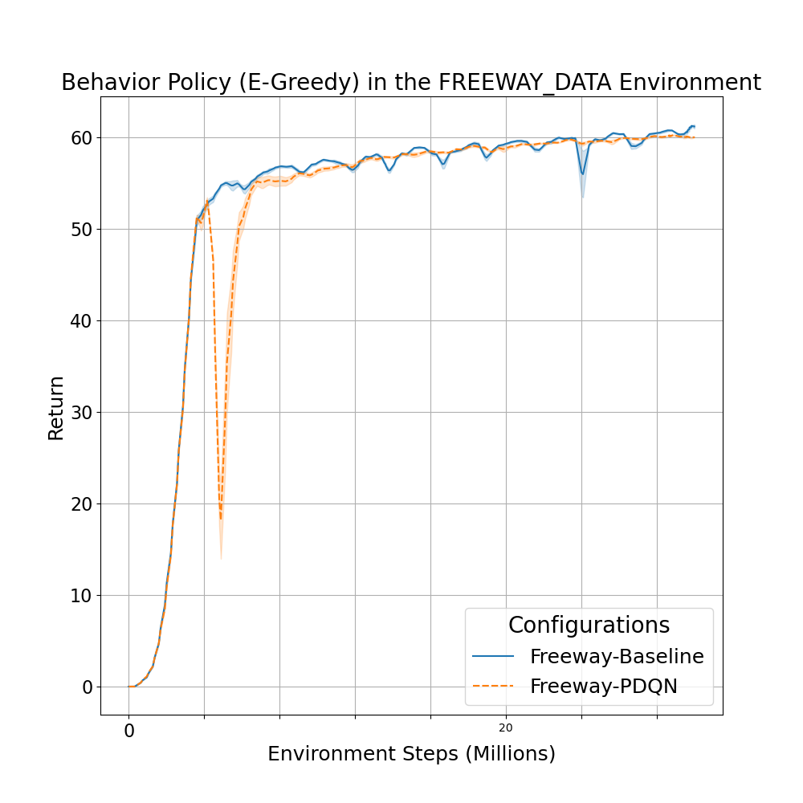
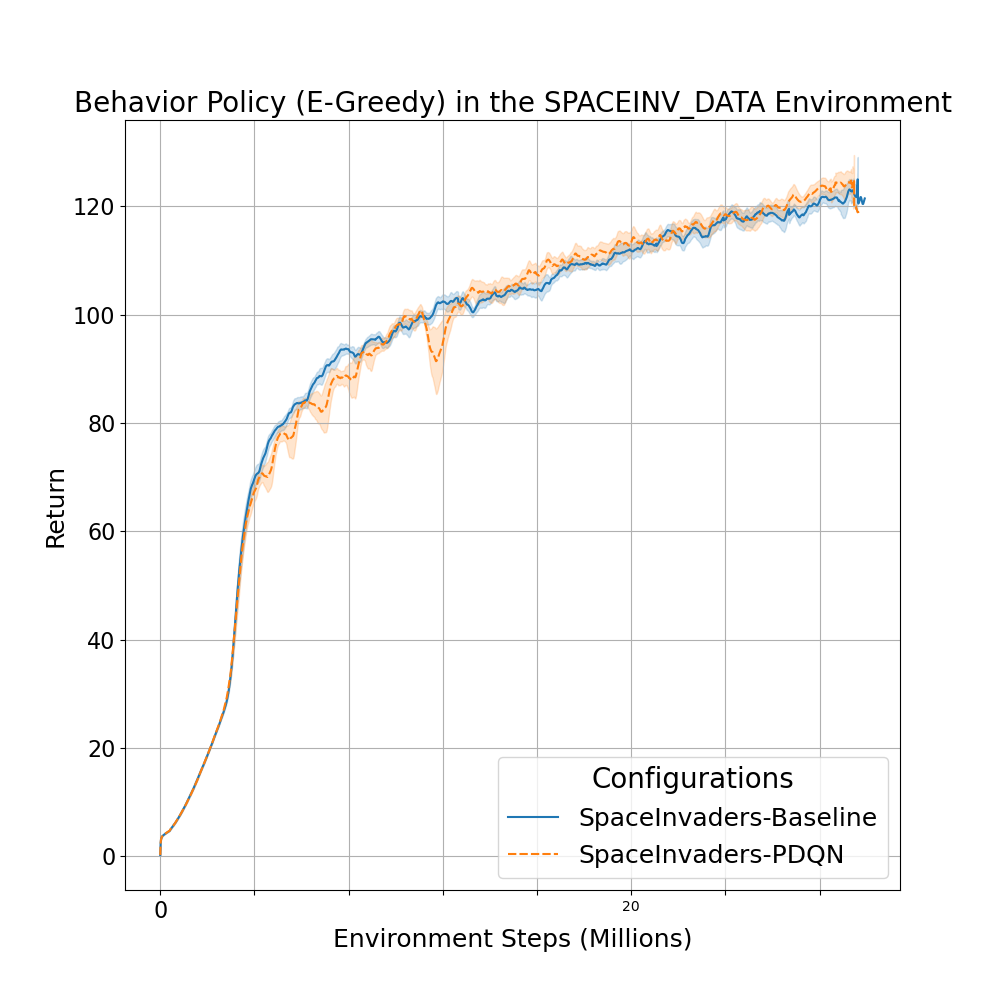
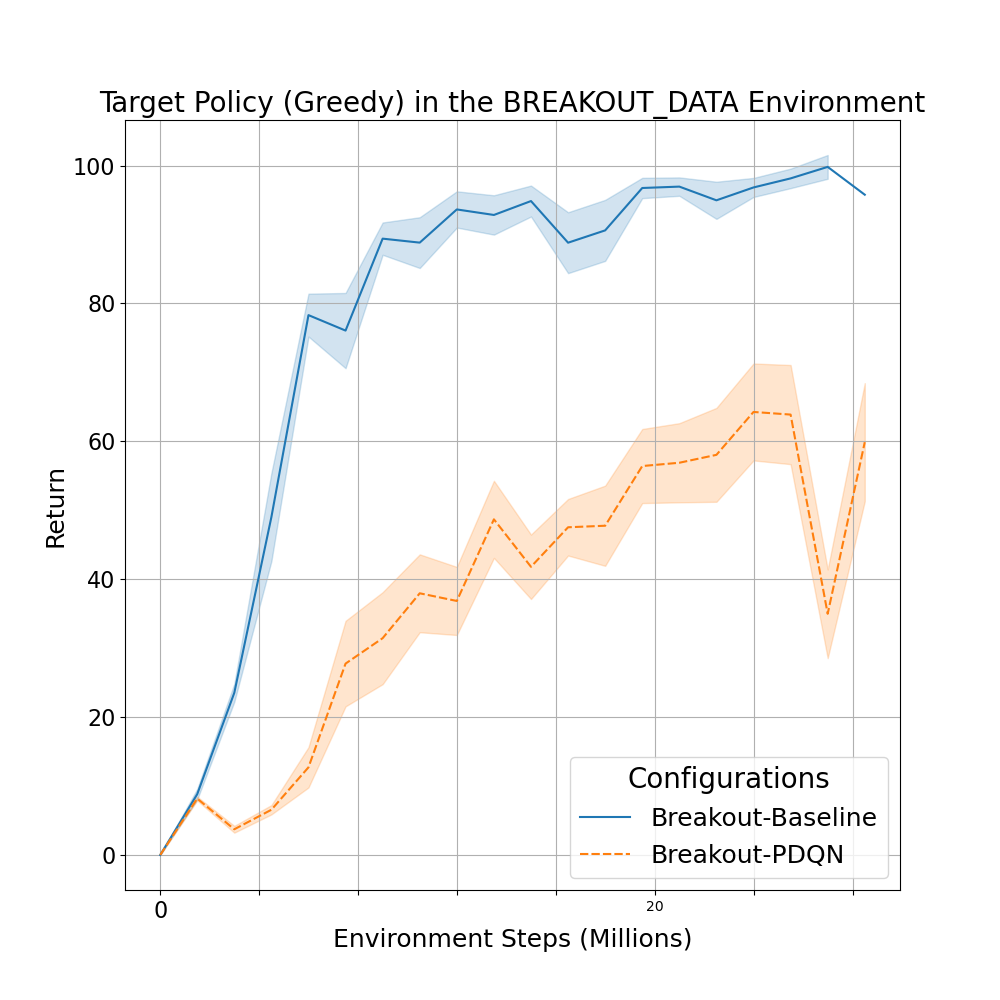
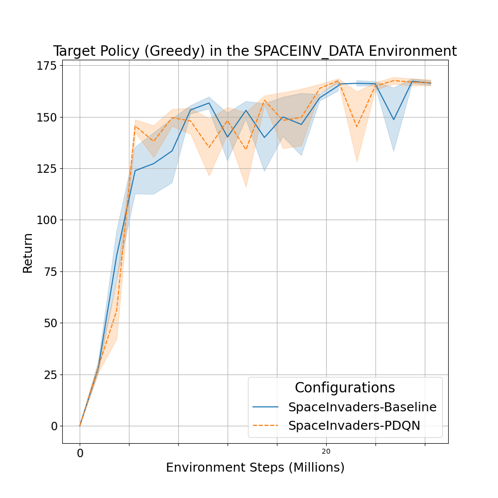

# Parallelizing Dyna-Q Learning: Accelerating Reinforcement Learning Through Networked Architectures

PDQN (Parallelized Dyna-Q Network) is a model-based reinforcement learning algorithm that combines the efficiency of Dyna-Q learning with the parallel processing capabilities of the [Parallelized Q-Network (PQN) architecture](https://arxiv.org/abs/2407.04811).  Dyna-Q leverages a learned model of the environment to perform planning, which can significantly accelerate learning. PDQN extends PQN by incorporating this planning component within a distributed GPU setting, further boosting performance.  This implementation maintains PQN's simplicity, performance, and structural integrity.  We compare PDQN's performance against PQN within the MinAtar environment.

## 🚀 Usage (highly recommended with Docker)

Steps:

1. Ensure you have Docker and the NVIDIA Container Toolkit installed.  See the installation guide: [NVIDIA Container Toolkit link](https://docs.nvidia.com/datacenter/cloud-native/container-toolkit/latest/install-guide.html).
2. (Optional) Set your WANDB key in the `docker/Dockerfile`.  This is recommended for experiment tracking.
3. Build the Docker image: `bash docker/build.sh`
4. Run a Docker container: `bash docker/run.sh`
5. Run a training script: `python purejaxql/pdqn_minatar.py +alg=pdqn_minatar`.  The `+alg=pdqn_minatar` argument specifies the PDQN algorithm.

## Experiment Configuration

The `tune` function can be used for hyperparameter search.  See the configuration file for PDQN-specific hyperparameter values.

## Experiment Results

Our experiments on the MinAtar environment demonstrate that PDQN slightly outperforms PQN in terms of final performance and seems to stabilize learning. More environments need to be tested in order to confirm or deny current findings.

### Results: Baseline vs PDQN (Target)

|            | Asterix         | Breakout        | Freeway         | Space Invaders  |
|------------|-----------------|-----------------|-----------------|-----------------|
| Baseline   | 73.10 ± 0.16    | 98.99 ± 1.33    | 39.72 ± 7.89    | 165.90 ± 1.26   |
| PDQN       | 72.96 ± 0.21    | 63.41 ± 6.76    | 65.80 ± 0.25    | 167.00 ± 1.14   |

### Results: Baseline vs PDQN (Behaviour)

|            | Asterix         | Breakout        | Freeway         | Space Invaders  |
|------------|-----------------|-----------------|-----------------|-----------------|
| Baseline   | 9.39 ± 0.59     | 42.73 ± 1.66    | 60.75 ± 0.15    | 123.39 ± 1.57   |
| PDQN       | 50.43 ± 0.49    | 28.42 ± 1.11    | 60.23 ± 0.07    | 125.39 ± 2.06   |

## Plotting Results

### Plots (Behaviour)

|  |  |
|----------------------------------------------|-----------------------------------------------|
|  |  |

### Plots (Target)

|  |  |
|-------------------------------------------|--------------------------------------------|
|  |  |

To recreate the plots from the experiment results, follow these steps:

1. Ensure you have the required Python packages installed. You can install them using the following command:
    ```sh
    pip install -r requirements.txt
    ```

2. Run the [make_plot.py](http://_vscodecontentref_/1) script to generate the plots. You will be prompted to enter the folder name containing the experiment data:
    ```sh
    python make_plot.py
    ```

3. Enter the folder name (e.g., `2024-12-04`) when prompted. The script will process the data and generate plots for both target and behavior policies.

## Calculating Means

To calculate the means from the experiment results, follow these steps:

1. Ensure you have the required Python packages installed. You can install them using the following command:
    ```sh
    pip install -r requirements.txt
    ```

2. Run the [get_mean.py](http://_vscodecontentref_/2) script to calculate the means. You will be prompted to enter the folder name containing the experiment data:
    ```sh
    python get_mean.py
    ```

3. Enter the folder name (e.g., `2024-12-04`) when prompted. The script will process the data and calculate the means for both target and behavior policies.